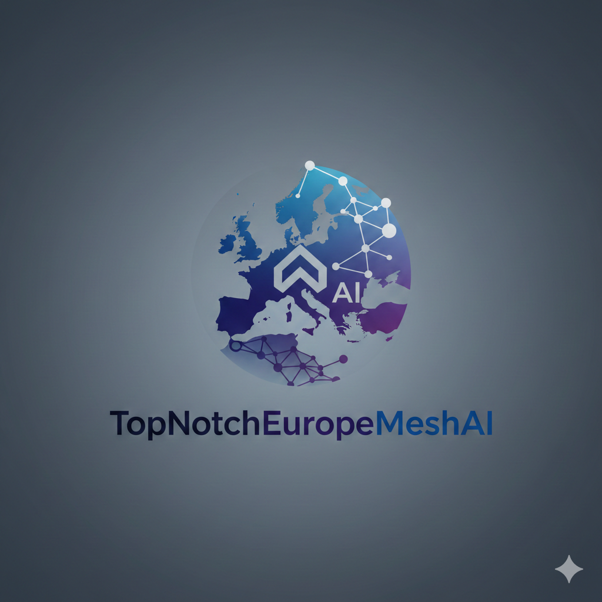

<p align="center">
  
</p>

<h1 align="center">TopNotchEuropeMeshAI</h1>

<p align="center">
  <strong>From Polish hackathon projects to global traction in one workflow.</strong>
</p>

<p align="center">
  
  
  
</p>

TopNotchEuropeMeshAI is a go-to-market automation toolkit for hackers and student builders.
It turns a repository into:

- platform-ready social content (Instagram + LinkedIn),
- AI-generated visual assets (images and short videos),
- and an investor-ready pitch deck.

The goal is simple: stop great hackathon projects from dying after demo day.

## Why This Exists

Most hackathon teams can build, but distribution gets postponed after the event.
TopNotchEuropeMeshAI closes that gap by giving founders a practical post-hackathon path:

1. understand the project and audience,
2. generate a clear narrative,
3. distribute content across channels fast.

## What You Get

| Capability | What it does |
|---|---|
| Unified project brief | Extracts context once, stores it in `.social/project-brief.json`, reuses it everywhere |
| Instagram publishing | Generates image/video assets and publishes via Instagram Graph API |
| LinkedIn workflow | Crafts professional posts and supports CLI-based LinkedIn publishing |
| Pitch deck generation | Builds an 8-slide investor deck from repo context using Slidev |
| Repo-first flow | Starts from your README/codebase so you do not rewrite your story for each channel |

## Built In Poland, For Builders Everywhere

TopNotchEuropeMeshAI is rooted in the Polish builder mindset:

- ship fast,
- stay practical,
- focus on real outcomes.

We built this for teams coming out of hackathons across Poland and Europe who need momentum, not another dashboard.

## Architecture (High-Level)

```text
Repo/README
   -> /go-to-market command
   -> context extraction + user input
   -> .social/project-brief.json (single source of truth)
   -> channel distribution:
      - Instagram (media generation + publish)
      - LinkedIn (post strategy + publish)
      - Pitch Deck (Slidev 8-slide framework)
```

## Quick Start

### 1. Clone and prepare dependencies

```bash
git clone https://github.com/barteksad/top-notch-europe-mesh-ai.git
cd top-notch-europe-mesh-ai

# Script dependencies (Gemini generation tools)
python3 -m pip install -r social/scripts/requirements.txt

# Instagram MCP server dependencies
python3 -m venv social/server/.venv
social/server/.venv/bin/pip install -r social/server/requirements.txt
```

### 2. Configure environment variables

Copy and fill:

```bash
cp .env.example .env
```

Required variables depend on which channels you use:

| Variable | Required for | Notes |
|---|---|---|
| `GEMINI_API_KEY` | AI image/video generation | Google Gemini API key |
| `INSTAGRAM_ACCESS_TOKEN` | Instagram posting | Graph API access token |
| `INSTAGRAM_USER_ID` | Instagram posting | Instagram Business account ID |
| `GITHUB_TOKEN` | Instagram local file upload flow | Used to upload media before publish |
| `GITHUB_REPO` | Instagram local file upload flow | Format: `owner/repo` |
| `LINKEDIN_CLIENT_ID` | LinkedIn CLI auth | LinkedIn app client ID |
| `LINKEDIN_CLI_REDIRECT_URI` | LinkedIn CLI auth | Redirect URI configured in app |

### 3. Run the plugin workflow

```bash
claude --plugin-dir ./social
```

Then run:

```text
/go-to-market .
```

This command will:

1. research your repo,
2. build/update `.social/project-brief.json`,
3. guide distribution to Instagram, LinkedIn, and pitch deck generation.

## Core Commands

- `/go-to-market` - End-to-end flow: research -> brief -> distribute
- `/post-instagram` - Instagram-only content flow

## Repository Structure

```text
.
├── social/
│   ├── commands/go-to-market.md
│   ├── server/server.py
│   ├── scripts/generate_image.py
│   ├── scripts/generate_video.py
│   └── skills/
│       ├── instagram-content-strategy/
│       ├── linkedin-cli/
│       ├── remotion-best-practices/
│       └── repo-to-fundraising-pitchdeck/
├── assets/topnotch-europe-mesh-ai-logo.png
├── slides.md
└── README.md
```

## Team

**Team name:** `TopNotchEuropeMeshAI`

Core contributors:

- Bartek Sadlej
- TomekNocon

## Roadmap

- Add X/Twitter and Facebook distribution as first-class channels
- Add stronger competitor and market research automation
- Add an exportable 14-day content calendar with scheduling recommendations
- Improve analytics feedback loop per channel

## License

Licensed under the Apache License 2.0. See `LICENSE`.
